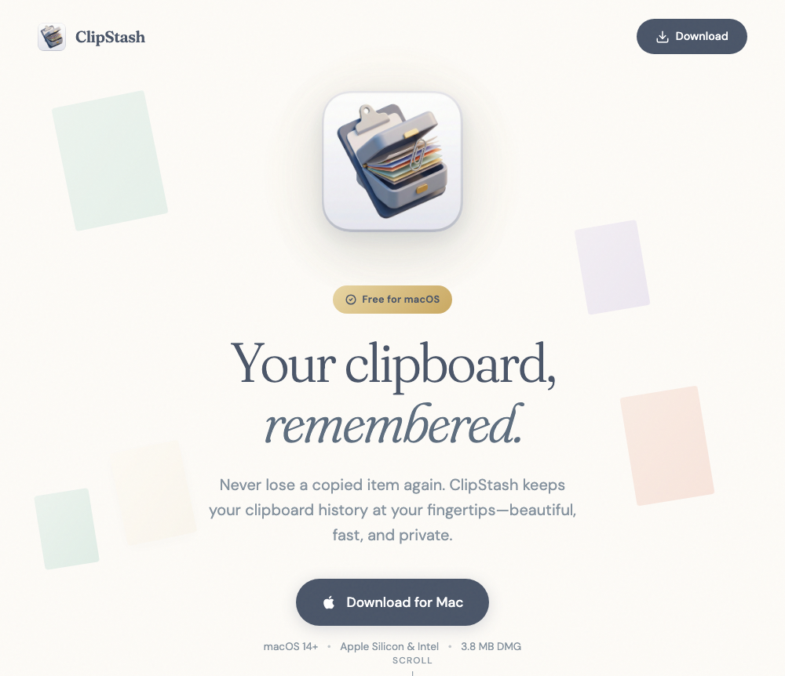

# ClipStash

ClipStash is a native macOS clipboard history manager. Press `Cmd+V` to open your recent clipboard items, search or navigate with the keyboard, and paste the selected item into the app you were using.

## Features

- `Cmd+V` clipboard history popup
- Keyboard navigation with arrows, `Enter`, and `Cmd+1` through `Cmd+9`
- Search and filtering across recent clipboard text
- Source app tracking
- Duplicate prevention
- Automatic cleanup after 24 hours
- Local encrypted history storage using AES-GCM with a Keychain-stored key
- Native SwiftUI menu bar app

## Privacy

ClipStash is designed to keep clipboard data on your Mac.

- Clipboard history is stored locally in `~/Library/Application Support/ClipStash/history.encrypted`.
- The encrypted history key is stored in the macOS Keychain.
- ClipStash does not include analytics, tracking, or cloud sync.
- Clipboard managers can capture sensitive values you copy, including passwords, tokens, and private text. Review your clipboard history regularly and clear it when needed.

## Permissions

ClipStash requires macOS Accessibility permission to intercept `Cmd+V` and simulate paste after you select an item. Without Accessibility permission, the global paste shortcut integration cannot run.

## Requirements

- macOS 14 Sonoma or later
- Xcode 15 or later recommended

## Building

1. Clone the repository.
2. Open `ClipStash.xcodeproj` in Xcode.
3. Select the `ClipStash` scheme.
4. Build and run the app.
5. Grant Accessibility permission when macOS prompts you.

You can also build from the command line:

```sh
xcodebuild -project ClipStash.xcodeproj -scheme ClipStash build
```

Run tests with:

```sh
xcodebuild test -project ClipStash.xcodeproj -scheme ClipStash -destination 'platform=macOS'
```

## Distribution

The source code is source-available for noncommercial use under the PolyForm Noncommercial License 1.0.0. Commercial use is not permitted without a separate written license from Pithos Labs. See [COMMERCIAL.md](COMMERCIAL.md).

Official signed builds may be distributed separately by Pithos Labs. Code signing identities, provisioning profiles, and App Store credentials are not included in this repository.

## Website

The static website lives in `website/` and includes lightweight Vercel API routes for page-view and download tracking.

- Set `CLIPSTASH_DOWNLOAD_URL` in Vercel to point `/download` at an official signed build, such as `https://github.com/pithoslabs/clipStash/releases/download/v1.0.0/ClipStash.dmg`.
- Do not commit release binaries, `.vercel/`, signing credentials, or local deployment artifacts.
- The app itself does not include analytics or telemetry.

## Contributing

Contributions are welcome. Please read [CONTRIBUTING.md](CONTRIBUTING.md) before opening a pull request.

Security issues should be reported privately. See [SECURITY.md](SECURITY.md).

## Trademark

The ClipStash name, logo, app icon, screenshots, and other brand assets are owned by Pithos Labs. Forks and derivative builds must use a different name and icon unless you have written permission.
